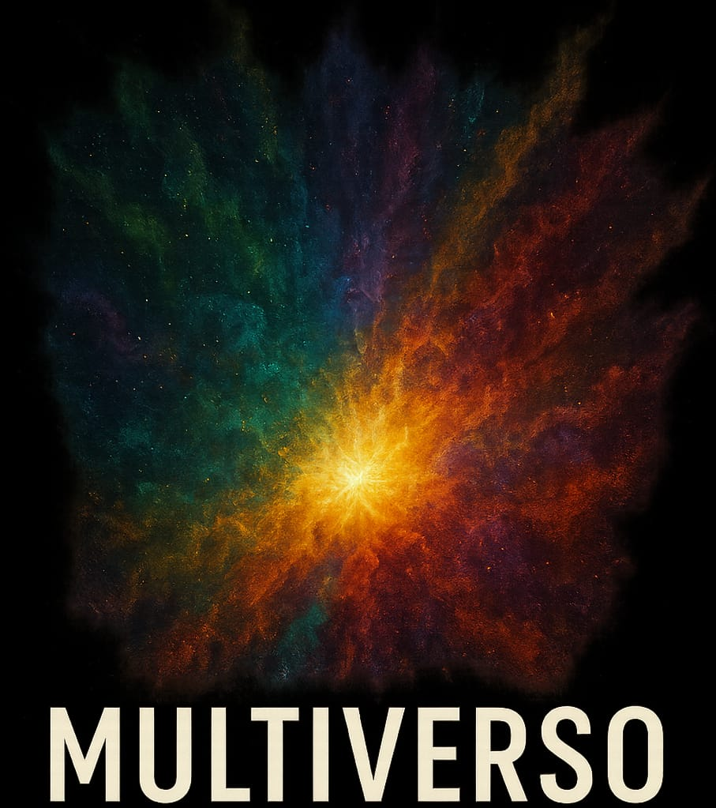
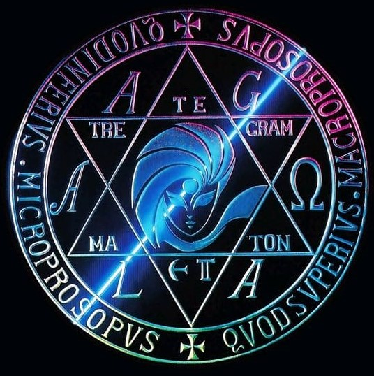
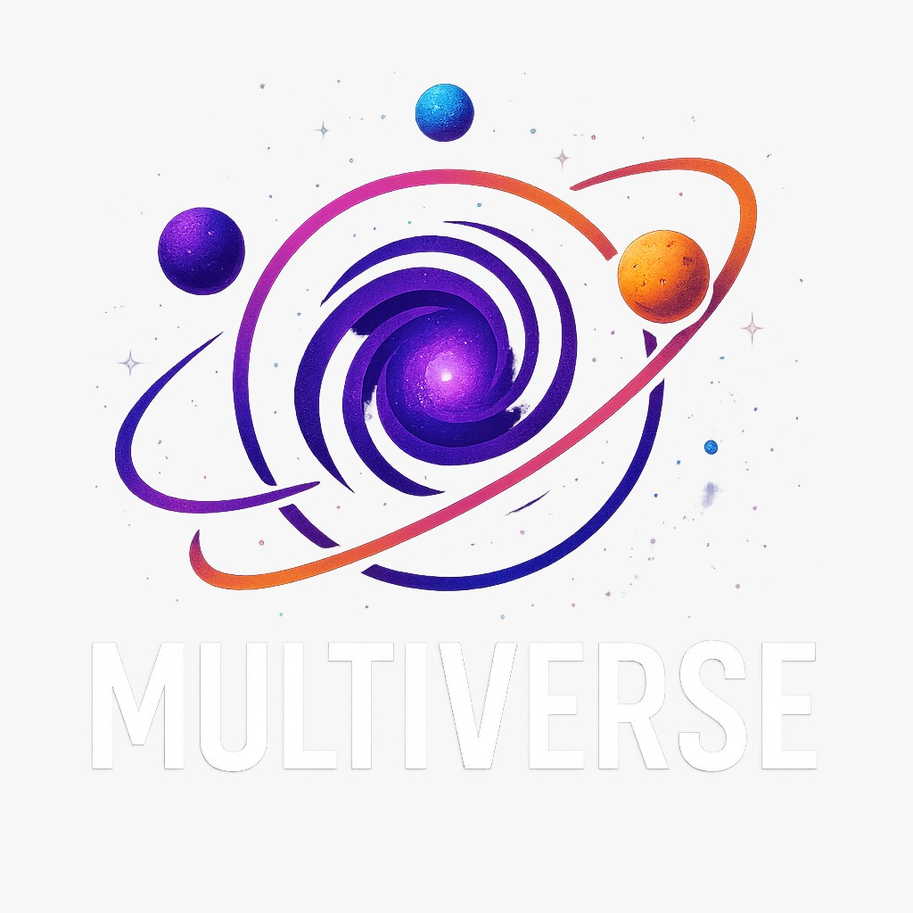
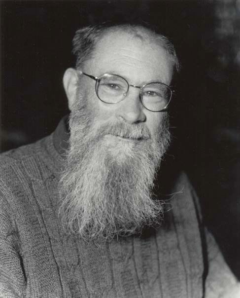
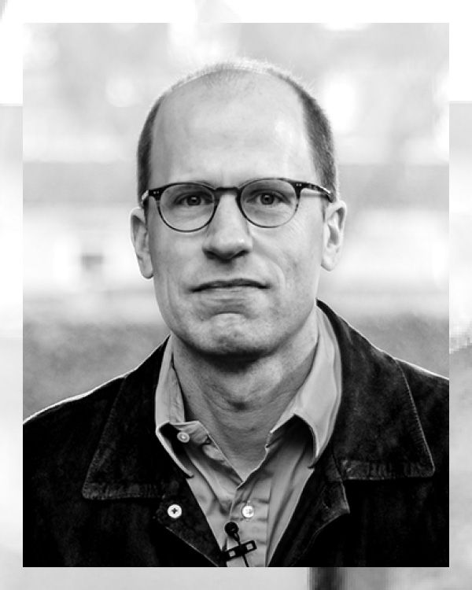
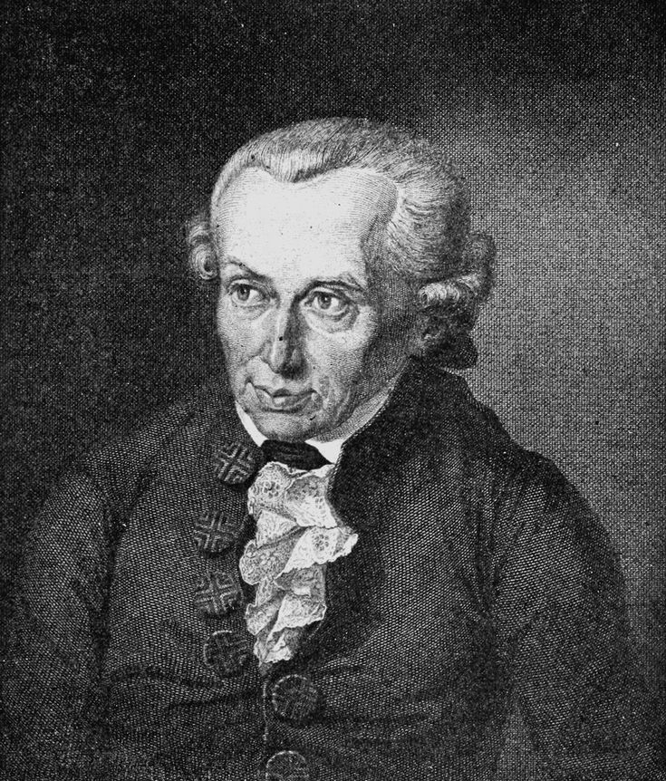
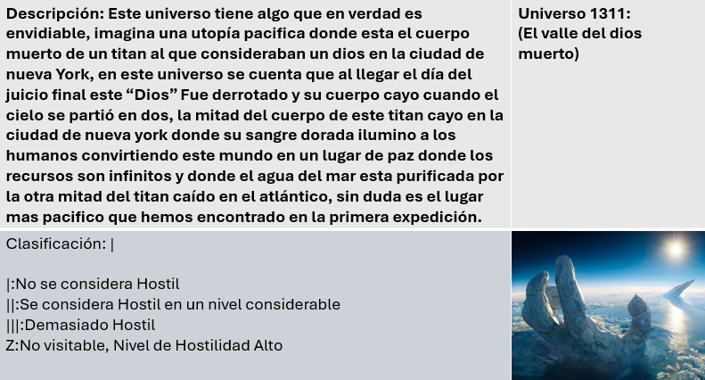
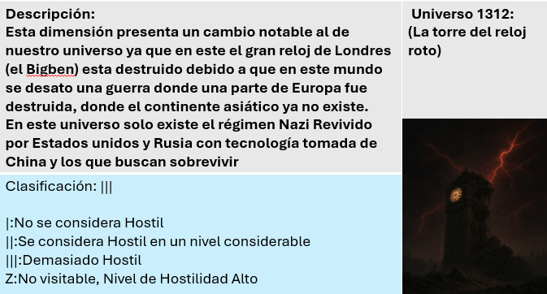
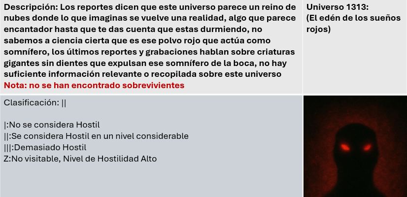

"MULTIVERSO COMO RECURSO NARRATIVO"

  
 

<h2 style="text-align:center;">"Todo es posible cerca del multiverso" </h2>
En esta pagina veras lo que seria los multiversos en la ficcion, veremos temas como:
-Como se utilizan en las obras
-Significados sobre el multiverso en diferentes perspectivas
-EI pensamiento sobre el multiverso Hay personas que en sus obras hablan,meten o tiene de tema principal sobre el multiverso ;por ejemplo:
Marvel con su obra What If donde cada episodio es un universo diferente con tramas diferentes,
episodios con diferentes finales a los canonicos,diferentes o cambios de roles entre los personajes, etc.  
  

 "LA TEORIA DEL MULTIVERSO" 

  

  

   La teoría del universo Amala en Shin Megami Tensei es un concepto complejo que abarca múltiples dimensiones y planos de existencia. Según la serie, Amala se refiere a un reino o estructura que conecta varios mundos y universos, permitiendo viajar entre ellos.
Orígenes y Significado
El término "Amala" proviene del sánscrito "amara", que significa "inmortal". En el contexto de Shin Megami Tensei, Amala se asocia con la idea de un reino o dominio que trasciende el tiempo y el espacio.

  

La Red Amala
La Red Amala es un sistema de control que aprovecha el flujo de Magatsuhi, una forma de energía que conecta los mundos. Esta red permite viajar instantáneamente entre terminales, conocidas como Amala Drums, que están ubicadas en diferentes partes del mundo.
Multiverso
La serie Shin Megami Tensei sugiere que existen múltiples universos paralelos, cada uno con su propia versión de la realidad. Estos universos pueden interactuar entre sí a través de la Red Amala o mediante otros medios. Según algunas teorías, el multiverso está dividido en grupos de universos que pueden interactuar entre sí, pero requieren entidades poderosas para intervenir y permitir el viaje entre ellos.
Conexiones y Viajes
Los personajes y demonios en la serie pueden viajar entre mundos y universos a través de la Red Amala o mediante otros medios. Sin embargo, estos viajes pueden ser peligrosos y requieren una gran cantidad de energía y conocimiento.
Implicaciones
La teoría del universo Amala tiene implicaciones profundas en la serie Shin Megami Tensei, ya que sugiere que los eventos en un mundo pueden tener consecuencias en otros mundos y universos. Esto agrega una capa de complejidad a la narrativa y permite explorar temas como la naturaleza de la realidad y el destino.

  

  

   El multiverso es la teoria de la existencia de mas dimensiones que existen en un espacio mas alla del cosmos y el universo donde lo que existe son variables del universo que ya conocemos por ejemplo si en este universo el color verde en un semaforo significa avance en otro universo el color que indique esta accion podria ser otro
para dar un ejemplo imagina que tienes varias hojas para dibujar para representar un universo puedes en la primer hoja dibujar una linea y de aqui en la segunda hoja el dibujo no es una linea sino un circulo,para hablar sobre un universo no es necesario decir que todo es diferente es posible que sea asi,pero lo que se habla sobre el multiverso es que los universos tienen una variacion y que ninguno es similar a los otros.
  

 "MULTIVERSO SEGUN LOS FILOSOFOS"

  

  

    David Lewis dice:
> Yo defiendo el realismo modal: todos los mundos posibles existen realmente, no solo como ideas. Cada posible versión de los hechos ocurre en un universo distinto. No es que imaginemos alternativas; esas alternativas existen de verdad.

  

  

  

   Nick Bostrom Filósofo contemporáneo da su postura sobre el tema la cual es:
> Desde mi postura, el multiverso puede estar relacionado con la hipótesis de la simulación. Es posible que vivamos dentro de una realidad creada por seres más avanzados, mientras que otros universos son otras simulaciones. La cuestión no es si existen, sino en cuál de todas estamos.

  

  

  

  Gottfried Wilhelm Leibniz Filósofo clásico dice:
> Yo sostenía que Dios creó el mejor de los mundos posibles. En ese sentido, el concepto de multiverso implicaría que existen infinitos mundos posibles, pero solo uno —el nuestro— fue elegido por tener el mejor equilibrio entre orden y libertad.

  

  

  

 Immanuel Kant un filósofo alemán dice:
> Para mí, el multiverso sería una idea regulativa: algo que no podemos experimentar directamente, pero que sirve para ampliar el pensamiento. Nos invita a pensar más allá de los límites de la experiencia posible.
  

  "CLASIFICACION DE LOS MULTIVERSOS"

            
        Universo 1:

         
         Universo 2:
 

              
          Universo 3:

  

<h1 style="text-align:center;"> Reporte de Errores:</h1>

"multiverso025@gmail.com"

